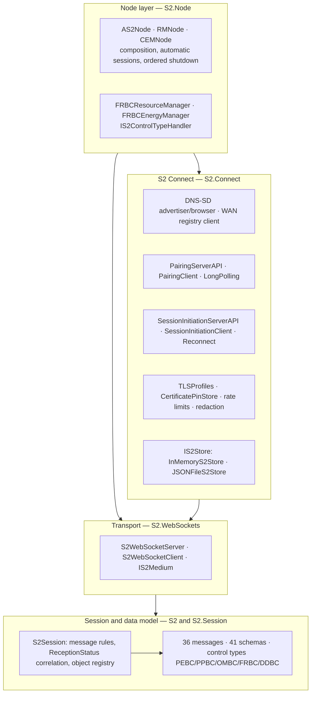

# WWCP S2

[](https://github.com/OpenChargingCloud/WWCP_S2/actions/workflows/ci.yml)
[](https://github.com/OpenChargingCloud/WWCP_S2/actions/workflows/nightly.yml)

An implementation of the **S2 standard** for energy flexibility (EN 50491-12-2, wire format
[S2 JSON v1.0.0](https://github.com/flexiblepower/s2-json)) and of
[**S2 Connect 1.0.0**](https://docs.s2standard.org/s2-connect/1.0.0/) (discovery, pairing,
session initiation and unpairing) in C# / .NET 10.

S2 defines how a *Customer Energy Manager* (CEM) and *Resource Managers* (RM) of flexible
devices such as EV chargers, heat pumps, batteries and PV systems exchange flexibility
information and instructions. This library is part of the World Wide Charging Protocol Suite
(WWCP) and is built on the Vanaheimr [Styx](https://github.com/Vanaheimr/Styx) and
[Hermod](https://github.com/Vanaheimr/Hermod) libraries.

- **Both S2 modes**: S2 Connect (pairing, access tokens, no `Handshake`) and plain
  S2 JSON over WebSockets (with `Handshake`, as spoken by s2-python and the s2-analyzer).
- **The whole S2 Connect lifecycle**: discovery over Multicast DNS / DNS-SD or a WAN endpoint
  registry, pairing with HMAC challenge-response, session initiation with access-token rotation,
  reconnection, and unpairing from either side.
- **The complete S2 JSON v1.0.0 data model**: 36 messages, 41 schemas, all five control types,
  validated against the embedded normative schemas in the test suite.
- **Hardened by construction**: TLS certificate pinning, per-source rate limiting, request and
  message size limits, and a redaction layer that keeps secrets out of the logs.

## Status

Under development, see [PLAN.md](https://github.com/OpenChargingCloud/WWCP_S2/blob/master/PLAN.md)
for the development plan, the architectural decisions and the phase status.
**Nothing in this repository is production ready yet**, and the public API may still change;
[CHANGELOG.md](https://github.com/OpenChargingCloud/WWCP_S2/blob/master/CHANGELOG.md) records
what each phase added.

| Phase | Content | Status |
|---|---|---|
| 0 | Foundation, conventions ([CONVENTIONS.md](https://github.com/OpenChargingCloud/WWCP_S2/blob/master/CONVENTIONS.md)), CI | done |
| 1a–1c | S2 JSON data model: 14 identifiers, 13 enumerations, 27 element types | done |
| 2a–2b | All 36 S2 JSON messages and the message parser with ReceptionStatus error mapping | done |
| 3 | Transport-agnostic session layer (`S2Session`, message rules, reception-status correlation, object registry, in-memory medium) | done |
| 4 | WebSocket transport on Hermod (`S2WebSocketServer`/`S2WebSocketClient`, bearer-token authentication, deflate, pings) | done |
| 5 | S2 Connect data model and crypto primitives (identifiers, tokens, pairing codes, fingerprints, base URLs, all API DTOs, HMAC challenge-response) | done |
| 6 | S2 Connect pairing server on Hermod's HTTP API (pairing interaction, rate limiting, LAN-only operations, long-polling, subnet check, in-memory store) | done |
| 7 | S2 Connect pairing client and long-polling client on Hermod's HTTP client | done |
| 8 | S2 Connect session initiation with access-token rotation, unpairing in both directions, reconnection strategy | done |
| 9 | Discovery: Multicast DNS and DNS-SD in Hermod, S2 endpoint advertiser and browser with `.local` resolution, in-memory service discovery, WAN endpoint registry client and reference API | done |
| 10 | Node layer (`AS2Node`, `RMNode`, `CEMNode`) composing pairing, session initiation, WebSocket and discovery with automatic sessions and an ordered shutdown; FRBC control-type handlers; `JSONFileS2Store`; sample console apps | done |
| 11a | Security hardening: TLS profiles, self-signed CA, certificate pin store and validator, the D13 chain spike and its decision, per-source rate limiting, request and message size limits, the log redaction layer with fuzz and negative suites | done |
| 12 | Documentation, public API baseline and packaging | done |

Interoperability and conformance testing against the reference implementations (s2-python,
s2-rust) lives in a separate repository.

## Quick start

The samples in
[WWCP_S2_Samples](https://github.com/OpenChargingCloud/WWCP_S2/tree/master/WWCP_S2_Samples)
are the executable version of everything below:

```bash
dotnet run --project WWCP_S2_Samples -- demo
```

runs a CEM and an EV charger resource manager in one process: discovery, pairing, session
initiation, an FRBC charging instruction, and unpairing.

```bash
dotnet run --project WWCP_S2_Samples -- browse 10
```

looks for S2 Connect endpoints on the local network via Multicast DNS for ten seconds.

### A resource manager

An RM node hosts one S2 node, advertises itself on the LAN while it is ready for pairing, and
answers the CEM's instructions through a control-type handler
([S2RM.EVCharger.cs](https://github.com/OpenChargingCloud/WWCP_S2/blob/master/WWCP_S2_Samples/S2RM.EVCharger.cs)):

```csharp
var rm = new RMNode(

             new HostedNode(
                 new NodeDescription(Node_Id.NewRandom, "ACME", "EV charger", "WallBox-b100",
                                     EnergyManagementRole.RM)
             ),

             new S2NodeOptions {
                 Description    = new EndpointDescription("EV charger"),
                 Deployment     = Deployment.LAN,
                 PairingUrl     = S2BaseURL.Parse("https://wallbox.local:8443/pairing/"),
                 HTTPPort       = IPPort.Parse(8443)
             },

             EVChargerRM.Details()

         );

// Fill Rate Based Control: the system description of the charger, and what to do
// with an instruction the CEM sends.
var frbc = new FRBCResourceManager(EVChargerRM.SystemDescription());

frbc.OnInstruction += (session, instruction, ct) => {
    Console.WriteLine($"charge actuator {instruction.ActuatorId} in mode {instruction.OperationMode}");
    return Task.FromResult<ReceptionStatusValue?>(null);   // null = RECEIVED
};

rm.RegisterControlType(frbc);

await rm.StartAsync();

// Pair with an endpoint the user picked, using the pairing code shown by the CEM.
var pairing = await rm.PairAsync(discoveredEndpoint.PairingUrl!.Value,
                                 PairingToken.Parse("H7K4N2"),
                                 Deployment.LAN);
```

Once paired, the node establishes the S2 session by itself — session initiation, the
single-use communication token, the WebSocket connection and the reconnection strategy are
part of `RMNode`.

### A customer energy manager

A CEM node runs the pairing and session-initiation servers, accepts the WebSocket connections
and drives the control type
([S2CEM.Minimal.cs](https://github.com/OpenChargingCloud/WWCP_S2/blob/master/WWCP_S2_Samples/S2CEM.Minimal.cs)):

```csharp
var cem = new CEMNode(

              new HostedNode(
                  new NodeDescription(Node_Id.NewRandom, "GraphDefined", "EMS", "Home Energy Manager",
                                      EnergyManagementRole.CEM)
              ),

              new S2NodeOptions {
                  Description             = new EndpointDescription("Home CEM"),
                  Deployment              = Deployment.LAN,
                  PairingUrl              = S2BaseURL.Parse("https://cem.local:8443/pairing/"),
                  SessionInitiationUrl    = S2BaseURL.Parse("https://cem.local:8443/connection/"),
                  WebSocketUrl            = URL.Parse("wss://cem.local:8444/"),
                  HTTPPort                = IPPort.Parse(8443),
                  WebSocketPort           = IPPort.Parse(8444)
              }

          );

var frbc = new FRBCEnergyManager();

frbc.OnSystemDescription += (session, description, ct) => {
    Console.WriteLine($"{description.Actuators.Count} actuator(s), storage '{description.Storage.FillLevelLabel}'");
    return Task.CompletedTask;
};

cem.RegisterControlType(frbc);

await cem.StartAsync();

// Show this pairing code to the user; it is valid for five minutes.
var pairingCode = cem.Node.IssueDynamicPairingToken();

// ... after the RM has paired and the session has started:
await cem.Sessions[0].SendAndAwaitReceptionStatusAsync(
          new FRBC_Instruction(Instruction_Id.Parse("instr1"),
                               Actuator_Id.Parse("actuator1"),
                               OperationMode_Id.Parse("om2"),
                               1.0,
                               DateTimeOffset.UtcNow,
                               AbnormalCondition: false)
      );
```

### Plain S2 JSON over WebSockets

Without S2 Connect — the mode the reference implementations speak — a session is a medium plus
an `S2Session`, and the `Handshake` exchange negotiates the message version:

```csharp
await using var client = new S2WebSocketClient(
                             URL.Parse("ws://localhost:8080/"),
                             CommunicationToken:  bearerToken,
                             SessionOptions:      new S2SessionOptions {
                                                      Mode  = S2SessionMode.Plain,
                                                      Role  = EnergyManagementRole.RM
                                                  }
                         );

var session = await client.ConnectSessionAsync();

await session.SendAndAwaitReceptionStatusAsync(EVChargerRM.Details());
```

`S2SessionMode.S2Connect` is the other mode: no `Handshake`, the version having been agreed
during pairing.

## Architecture



The dependencies point downwards only, and an architecture test
([LayeringTests.cs](https://github.com/OpenChargingCloud/WWCP_S2/blob/master/WWCP_S2Tests/Architecture/LayeringTests.cs))
enforces it: the data model and the session layer know nothing of S2 Connect, and S2 Connect
knows nothing of the node layer. A later split into separate assemblies, or a client-only build
for a constrained RM, therefore stays possible.

| Namespace | Content |
|---|---|
| `cloud.charging.open.protocols.S2` | Identifiers, enumerations, element types, the 36 messages, the message parser |
| `…S2.Session` | `S2Session`, `IS2Medium`, message rules, reception-status correlation, control-type handlers |
| `…S2.WebSockets` | `S2WebSocketServer`, `S2WebSocketClient` and their media |
| `…S2.Connect` | Discovery, pairing, session initiation, unpairing, stores, certificates, rate limiting, redaction |
| `…S2.Node` | `AS2Node`, `RMNode`, `CEMNode`, `S2NodeOptions`, the FRBC handlers |

## Feature matrix

| S2 JSON v1.0.0 | State |
|---|---|
| All 36 messages, parser, ReceptionStatus error mapping | complete, schema-validated |
| Common types, `Duration`, RFC 3339 timestamps, semantic rules of the schema descriptions | complete |
| Session layer: message rules per state and direction, reception-status correlation, revocation, object registry | complete |
| Plain mode `Handshake`/`HandshakeResponse`, including the legacy `0.0.2-beta` version string | complete |
| FRBC control type: data model, messages **and** RM/CEM handlers | complete |
| PEBC, PPBC, OMBC, DDBC control types: data model and messages | complete, no handler yet |

| S2 Connect 1.0.0 | State |
|---|---|
| Pairing server and client (LAN and WAN formulas, replay of duplicates, one-second delay, 15 s attempt window) | complete |
| Long-polling server and client (`waitForPairing`, the specification's client policy table) | complete |
| Session initiation, access-token rotation, single-use communication tokens | complete |
| Unpairing from both sides, tombstones, reconnection strategy | complete |
| Discovery: Multicast DNS / DNS-SD advertise and browse, `.local` resolution | complete |
| WAN endpoint registry: client, query model and a reference API | complete |
| WebSocket communication (bearer token, permessage-deflate, pings, size limits) | complete |
| MQTT communication | not specified by S2 Connect 1.0.0, not implemented |

| Operations | State |
|---|---|
| Persistence: `InMemoryS2Store`, `JSONFileS2Store` (atomic writes, `ISecretProtector` hook), store contract tests | complete |
| TLS: profiles, self-signed CA, certificate pin store and validator (see D13) | complete |
| Rate limiting per source, request and WebSocket message size limits | complete |
| Log redaction of secrets, structured state included | complete |
| `Microsoft.Extensions.Logging` throughout, `System.Diagnostics.Metrics` counters | complete |
| Secret protection at rest (DPAPI, KMS) | hook only, no implementation |

## Deployment and ports

S2 Connect distinguishes the *deployment* of an endpoint, which decides the URLs, the
challenge-response formula and which operations exist at all:

| Deployment | Meaning | Discovery | Pairing formula |
|---|---|---|---|
| `Deployment.LAN` | Endpoint on the local network, reached by an mDNS `.local` name | DNS-SD (`_s2connect._tcp`) | `HMAC(challenge, token ‖ certificateFingerprint)` |
| `Deployment.WAN` | Endpoint reachable on the internet under a domain name | WAN endpoint registry | `HMAC(challenge, token ‖ domainName)` |

`S2NodeOptions.IsWANPairingServerForLANEndpoint` marks the third variant of the specification:
an OEM cloud that runs the pairing server for a LAN device.

| Port | Protocol | Used by | Note |
|---|---|---|---|
| `HTTPPort` | HTTPS | Pairing API, session initiation API, long-polling | One HTTP server carries all three; the port is part of the advertised pairing URL. TLS is mandatory outside tests (`S2ParserOptions.AllowInsecureURLs`). |
| `WebSocketPort` | WSS | S2 message transport | May share the HTTP port in a deployment that routes by path. |
| 5353/UDP | Multicast DNS | Discovery (`224.0.0.251`, `ff02::fb`) | LAN deployments only; the endpoint advertises while it is ready for pairing. |
| 443/TCP | HTTPS | WAN endpoint registry | Client and reference API. |

There are no default port numbers: an S2 Connect endpoint publishes its port in the DNS-SD
`SRV` record and in its pairing URL, so the host application chooses it.

## Security defaults

The details, and the reasoning behind them, are in
[CONVENTIONS.md §16](https://github.com/OpenChargingCloud/WWCP_S2/blob/master/CONVENTIONS.md)
and [SECURITY.md](https://github.com/OpenChargingCloud/WWCP_S2/blob/master/SECURITY.md).

| Setting | Default | Option |
|---|---|---|
| Certificate pinning after pairing | enforced | `S2NodeOptions.EnforceCertificatePinning` |
| Secrets redacted in every log entry | on | `S2NodeOptions.RedactSecretsInLogs` |
| HTTP body limit (server) / per API | 1 MiB / 64 KiB | `MaxHTTPBodySize`, `MaxRequestBodySize` |
| WebSocket message limit, both directions | 1 MiB (close 1009) | `MaxWebSocketMessageSize` |
| Requests per source and minute | 300 pairing / 120 session initiation / 300 registry | `RateLimitCapacity`, `RateLimitRefillPeriod` |
| Overload answer | 503 with `Retry-After` | `UseTooManyRequestsStatusCode` for 429 |
| LAN-only operations restricted to the local subnet | on | `S2NodeOptions.SubnetPolicy` |

A LAN endpoint presents a **single self-signed server certificate that is its own CA**, and its
SHA-256 is what the peer pins during pairing; rotating it requires re-pairing. The measurement
behind that decision is recorded as D13 in PLAN.md and guarded by a test.

## Building

The solution references Styx and Hermod as sibling directories:

```
<parent>/Styx/Styx/Styx.csproj
<parent>/Hermod/Hermod/Hermod.csproj
<parent>/WWCP_S2/WWCP_S2.slnx
```

```bash
git clone https://github.com/Vanaheimr/Styx
git clone https://github.com/Vanaheimr/Hermod
git clone https://github.com/OpenChargingCloud/WWCP_S2
cd WWCP_S2
dotnet build WWCP_S2.slnx
dotnet test WWCP_S2Tests/WWCP_S2Tests.csproj --filter "TestCategory!=Multicast&TestCategory!=Timing"
```

Two test categories are excluded from that run because they depend on the machine rather than
on the code: `Timing` (real-clock behaviour) and `Multicast` (DNS-SD over real UDP sockets).
The [CI workflow](https://github.com/OpenChargingCloud/WWCP_S2/blob/master/.github/workflows/ci.yml)
gates every push on Windows and Debian 13 with the same filter; the
[nightly workflow](https://github.com/OpenChargingCloud/WWCP_S2/blob/master/.github/workflows/nightly.yml)
runs `Timing` as well, probes `Multicast` informationally, and builds the same code against
Styx and Hermod `master` to notice when the pinned revisions in CI have aged.

The public surface of the library is recorded in
[PublicAPI.baseline.txt](https://github.com/OpenChargingCloud/WWCP_S2/blob/master/WWCP_S2Tests/Architecture/PublicAPI.baseline.txt);
a test compares it on every run, so an API change shows up as a diff in the same commit that
causes it. Regenerate it deliberately:

```bash
S2_UPDATE_PUBLIC_API=1 dotnet test WWCP_S2Tests/WWCP_S2Tests.csproj --filter "FullyQualifiedName~PublicAPITests"
```

## NuGet package

`dotnet pack WWCP_S2/WWCP_S2.csproj -c Release` builds
`cloud.charging.open.protocols.S2` with its README, the third-party notices, XML documentation
and a symbol package.

The package is **not published on nuget.org**, and it cannot be until Styx and Hermod are:
both are referenced as source siblings, and a package must not invent ids for them — `Styx` on
nuget.org belongs to an unrelated library. The package therefore declares neither of them as a
dependency and instead fails a consuming build with a readable message (`S2NUG001`) when they
are missing. Until then, use the library from source, or supply both assemblies yourself:

```xml
<PackageReference Include="cloud.charging.open.protocols.S2" Version="0.1.0" />
<ProjectReference Include="..\Hermod\Hermod\Hermod.csproj" />
<ProjectReference Include="..\Styx\Styx\Styx.csproj" />
```

## Documentation

| Document | Content |
|---|---|
| [PLAN.md](https://github.com/OpenChargingCloud/WWCP_S2/blob/master/PLAN.md) | The development plan: scope, the sixteen architectural decisions with their rationale, the phases, the test strategy and the known risks |
| [CONVENTIONS.md](https://github.com/OpenChargingCloud/WWCP_S2/blob/master/CONVENTIONS.md) | The binding authoring guide: namespaces, identifier and enumeration templates, parser and serialiser shapes, options records, the security rules |
| [CHANGELOG.md](https://github.com/OpenChargingCloud/WWCP_S2/blob/master/CHANGELOG.md) | What each phase added, and every fix that came out of a review |
| [SECURITY.md](https://github.com/OpenChargingCloud/WWCP_S2/blob/master/SECURITY.md) | How to report a vulnerability, and the security model of the implementation |
| [THIRD-PARTY-NOTICES.md](https://github.com/OpenChargingCloud/WWCP_S2/blob/master/THIRD-PARTY-NOTICES.md) | The embedded normative schemas and OpenAPI files and their licenses |

Every serialised message and data structure is validated against the embedded s2-json v1.0.0
schemas in the test suite; the data model enforces the semantic rules of the schema descriptions.
Tests carry `[S2C("<section>.<row>")]` properties that link them to the normative rule they cover.

## Licenses

WWCP S2 is released under the GNU Affero General Public License 3.0 or later, see
[LICENSE](https://github.com/OpenChargingCloud/WWCP_S2/blob/master/LICENSE). The embedded S2 JSON
schemas and S2 Connect OpenAPI files are Apache-2.0 licensed by the FlexiblePower Alliance
Network, see
[THIRD-PARTY-NOTICES.md](https://github.com/OpenChargingCloud/WWCP_S2/blob/master/THIRD-PARTY-NOTICES.md).

## Your contributions

This software is developed by [GraphDefined GmbH](http://www.graphdefined.com).
We appreciate your participation in this ongoing project, and your help to improve it.
If you find bugs, want to request a feature or send us a pull request, feel free to
use the normal GitHub features to do so. For this please read the
[Contributor License Agreement](https://github.com/OpenChargingCloud/WWCP_S2/blob/master/Contributor%20License%20Agreement.txt)
carefully and send us a signed copy.
